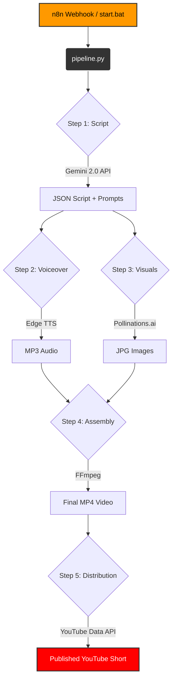

# 🚀 YouTube Automation Engine — GOD MODE

> **AI Tools + Make Money Online** niche | Hinglish | ₹0 cost | Fully automated

---

## ⚡ 5-Minute Quick Start

### Step 1 — Run Setup (one time)
```batch
setup.bat
```

### Step 2 — Add API Key
Open `.env` → add your Gemini API key:
```
GEMINI_API_KEY=AIzaSy...your-key-here
```
Get FREE key (1500 req/day): https://aistudio.google.com/apikey

### Step 3 — Start Everything
```batch
start.bat
```
Opens dashboard at **http://localhost:3000**

### Step 4 — Generate Your First Video
```batch
python pipeline.py --type short --dry-run
```

---

## 🛠️ Tech Stack & Architecture

| Component | Tool Used | Cost | Purpose |
|-----------|-----------|------|---------|
| **Brain** | Gemini 2.0 Flash | ₹0 (1500/day) | Generates viral Hinglish scripts |
| **Voice** | Edge TTS | ₹0 (Unlimited) | Human-like Hindi voiceovers |
| **Vision** | Pollinations.ai | ₹0 (Unlimited) | High-quality AI image generation |
| **Editor** | FFmpeg | ₹0 (Open Source) | Assembles slides, audio, and effects |
| **Manager**| n8n | ₹0 (Self-hosted) | Orchestrates the entire workflow |

### 🔄 Fully Automated Pipeline Architecture



---

## 🎯 Pipeline Commands

```batch
# Single short video (no upload)
python pipeline.py --type short --dry-run

# Custom topic
python pipeline.py --type short --topic "Free AI tool for students 2026" --dry-run

# Long form video
python pipeline.py --type long --dry-run

# Batch: 7 shorts in one run
python pipeline.py --batch 7 --type short --dry-run

# With YouTube upload (after OAuth setup)
python pipeline.py --type short

# Different voice (female)
python pipeline.py --type short --voice hi-IN-SwaraNeural --dry-run
```

---

## 🗣️ Available Voices (all FREE)

| Voice | Type | Style |
|-------|------|-------|
| `hi-IN-MadhurNeural` | Male Hindi | Young, energetic ⭐ Recommended |
| `hi-IN-SwaraNeural` | Female Hindi | Clear, professional |
| `en-IN-PrabhatNeural` | Male Indian English | For English-heavy scripts |
| `en-IN-NeerjaNeural` | Female Indian English | For English-heavy scripts |

List all voices: `python scripts/generate_voice.py --list-voices`

---

## 📁 Project Structure

```
atomatioin videos/
├── pipeline.py              # 🚀 Master pipeline (run this)
├── setup.bat                # One-click setup
├── start.bat                # Start dashboard
├── .env                     # Your API keys (NEVER commit)
├── requirements.txt         # Python deps
│
├── scripts/
│   ├── generate_script.py   # Gemini API → Hinglish script
│   ├── generate_voice.py    # Edge TTS → MP3 voiceover
│   ├── generate_visuals.py  # Pollinations.ai → images
│   ├── assemble_video.py    # FFmpeg → final MP4
│   └── upload_youtube.py    # YouTube Data API → upload
│
├── dashboard/
│   ├── server.js            # Express API server
│   └── public/index.html   # Dark-mode control center
│
├── config/
│   ├── topics.json          # 40+ video topics by category
│   ├── schedule.json        # Posting schedule
│   └── voices.json          # Voice configuration
│
├── n8n_workflows/
│   └── youtube_automation.json  # Import to n8n
│
├── output/
│   ├── scripts/             # Generated JSON scripts
│   ├── audio/               # MP3 voiceovers
│   ├── images/              # AI generated images
│   ├── videos/              # Final MP4 files
│   ├── thumbnails/          # YouTube thumbnails
│   └── logs/                # Pipeline logs
│
└── templates/
    └── music/               # Add lofi_beat.mp3 here for BGM
```

---

## 🔧 Individual Module CLI

```batch
# Just generate a script
python scripts/generate_script.py --type short --topic "free AI tool"

# Just generate voice from script file
python scripts/generate_voice.py --script output/scripts/short_xxx.json

# Just generate images
python scripts/generate_visuals.py --mode thumbnail --text "FREE AI TOOL"

# Assemble video manually
python scripts/assemble_video.py --images img1.jpg img2.jpg --audio voice.mp3
```

---

## 📲 YouTube Upload Setup (Day 2)

1. Go to https://console.cloud.google.com
2. Create project → Enable **YouTube Data API v3**
3. Create OAuth 2.0 credentials (Desktop App)
4. Download JSON → save as `config/youtube_oauth.json`
5. Install: `pip install google-auth google-auth-oauthlib google-api-python-client`
6. First run opens browser for authorization (one-time)

Then remove `--dry-run` from pipeline commands.

---

## 🔥 n8n Workflow (Optional)

1. Start n8n: `npx n8n start`
2. Open http://localhost:5678
3. Import `n8n_workflows/youtube_automation.json`
4. Set env variable: `GEMINI_API_KEY`
5. Activate workflow — triggers via webhook POST

---

## 🎵 Background Music

Drop any `.mp3` file into `templates/music/` — pipeline will auto-mix it at 12% volume under the voiceover.

Free lofi music: https://pixabay.com/music/search/lofi/

---

## 📅 Recommended Posting Schedule

| Day | Category | Time |
|-----|---------|------|
| Mon | Free AI Tools | 7 PM IST |
| Tue | Automation Hacks | 7 PM IST |
| Wed | ChatGPT Tricks | 7 PM IST |
| Thu | Earn Online | 7 PM IST |
| Fri | Trending Tech | 7 PM IST |
| Sat | Free AI Tools | 7 PM IST |
| Sun | Shorts batch | All day |

---

## 💡 Pro Tips

1. **First 3 seconds = everything** — the hook determines if people watch
2. **Upload 2 shorts/day minimum** — YouTube rewards consistency
3. **7 PM IST = peak Indian traffic** — always post at this time
4. **Add real tool screen recordings** — viewers trust "show me" 10x more than slideshow
5. **OBS Studio (free)** — best screen recorder, add to video over AI images

---

*Built with ❤️ using Antigravity | ₹0 total cost*
